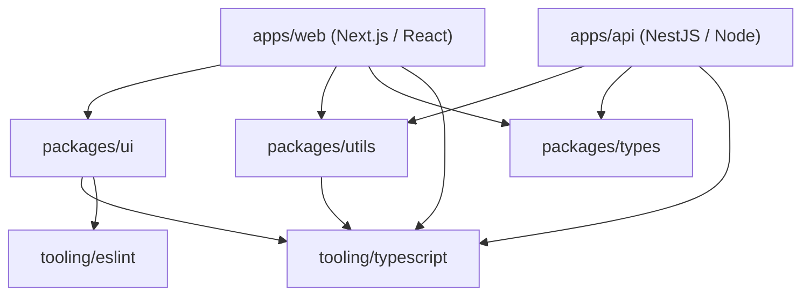

# Workspace Architecture & Principles

This monorepo is engineered to be a unified, high-performance workspace for React, Next.js, and NestJS applications while maintaining strict boundaries, framework-agnostic foundation standards, and zero leakage between projects.

---

## 1. Core Principles

1. **Framework-Agnostic Foundation**: Root-level configurations (TypeScript, ESLint, Prettier, Git, CI) do not make assumptions about specific UI or backend frameworks. Specialized configs are housed in `tooling/` and extended by packages/apps.
2. **Strict Boundary Isolation**: Applications in `apps/` must never import directly from other applications. Code reuse occurs exclusively via packages in `packages/`.
3. **Explicit Package Dependencies**: Every workspace package or app must declare all of its external and workspace dependencies in its local `package.json` using the `workspace:*` protocol.
4. **Single Source of Configuration**: Standard presets for TypeScript, ESLint, and Prettier reside under `tooling/` (e.g. `@repo/typescript-config`, `@repo/eslint-config`, `@repo/prettier-config`).
5. **Deterministic Builds via Turborepo**: All build, lint, typecheck, and test tasks are orchestrated through Turborepo with inputs/outputs explicitly tracked for caching.

---

## 2. Monorepo Topology

---

## 3. Directory Layout Breakdown

| Directory   | Purpose                                                                            | Rules & Constraints                                   |
| :---------- | :--------------------------------------------------------------------------------- | :---------------------------------------------------- |
| `apps/`     | Deployable applications (Next.js, React SPA, NestJS APIs)                          | Must be self-contained; no cross-app imports.         |
| `packages/` | Shared libraries, UI components, utilities, schemas                                | Must export type declarations and clean entry points. |
| `tooling/`  | Internal configuration packages (`@repo/eslint-config`, `@repo/typescript-config`) | Shared tooling only; no business logic.               |
| `docs/`     | Workspace, architecture, and developer documentation                               | Keeps all developer guidelines up-to-date.            |
| `scripts/`  | Automation and sanity check scripts                                                | Node / Shell scripts for repo-level tooling.          |
| `.github/`  | GitHub Actions workflows and contribution templates                                | Automated CI/CD pipelines.                            |
| `.husky/`   | Git hooks for pre-commit linting and commit message checks                         | Ensures commit quality before reaching remote.        |

---

## 4. Dependency Management Strategy

- **Package Manager**: `pnpm` with workspace protocol (`workspace:*`).
- **Hoisting**: Dependencies are isolated in workspace packages; shared toolchains are declared at root or inside `tooling/`.
- **Node Engine**: Pinned using `.nvmrc` and `.npmrc` (`engine-strict=true`).
- **Peer Dependencies**: Automatically resolved by pnpm (`auto-install-peers=true`).
