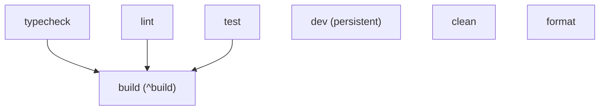

# Turborepo Guide

This workspace uses [Turborepo](https://turbo.build/) to orchestrate builds, test suites, linter runs, and development servers with high caching efficiency.

---

## 1. Pipeline Tasks Overview

The workspace defines the following standard task graph in `turbo.json`:



- **`build`**: Runs the package/app build scripts. Topological dependencies (`^build`) ensure shared libraries are compiled before depending apps.
- **`dev`**: Runs local development servers concurrently in streaming or interactive mode. Never cached.
- **`lint`**: Runs ESLint across all projects in parallel.
- **`typecheck`**: Runs TypeScript type checks (`tsc --noEmit`) across projects.
- **`test`**: Runs unit and integration test suites with coverage output tracking.
- **`format`**: Runs code format verification.
- **`clean`**: Cleans local build artifacts.

---

## 2. Common Turborepo Commands

### Run Tasks Across All Packages

```bash
pnpm turbo build
pnpm turbo lint
pnpm turbo typecheck
pnpm turbo test
```

### Filtering Tasks

Run tasks for a specific app or package:

```bash
# Run build only for 'web'
pnpm turbo build --filter=web

# Run dev only for 'api' and its dependencies
pnpm turbo dev --filter=api...

# Run lint for all packages except 'web'
pnpm turbo lint --filter=!web
```

### Dry Run

Inspect the execution plan and cache hits without running tasks:

```bash
pnpm turbo build --dry-run
```

---

## 3. Caching Strategy

- **Inputs**: Files matching `$TURBO_DEFAULT$` and `.env*` are fingerprinted.
- **Outputs**: Specified output directories (`dist/**`, `.next/**`, `build/**`, `coverage/**`) are stored in the local Turborepo cache (`.turbo/`).
- **Global Dependencies**: Changes to root configuration files (`tsconfig.base.json`, root `.env`) invalidate all task caches.
