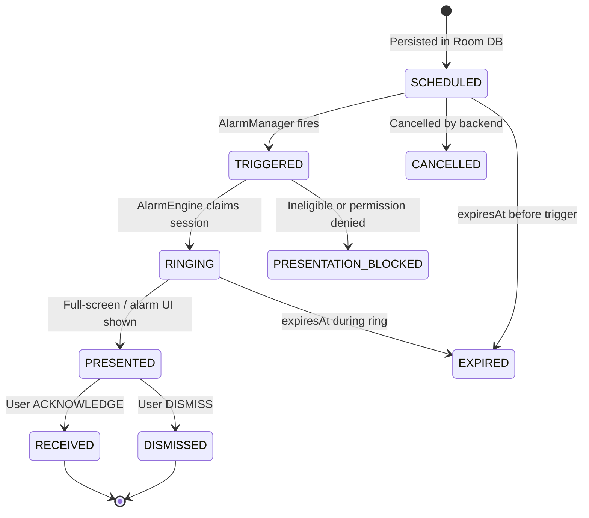
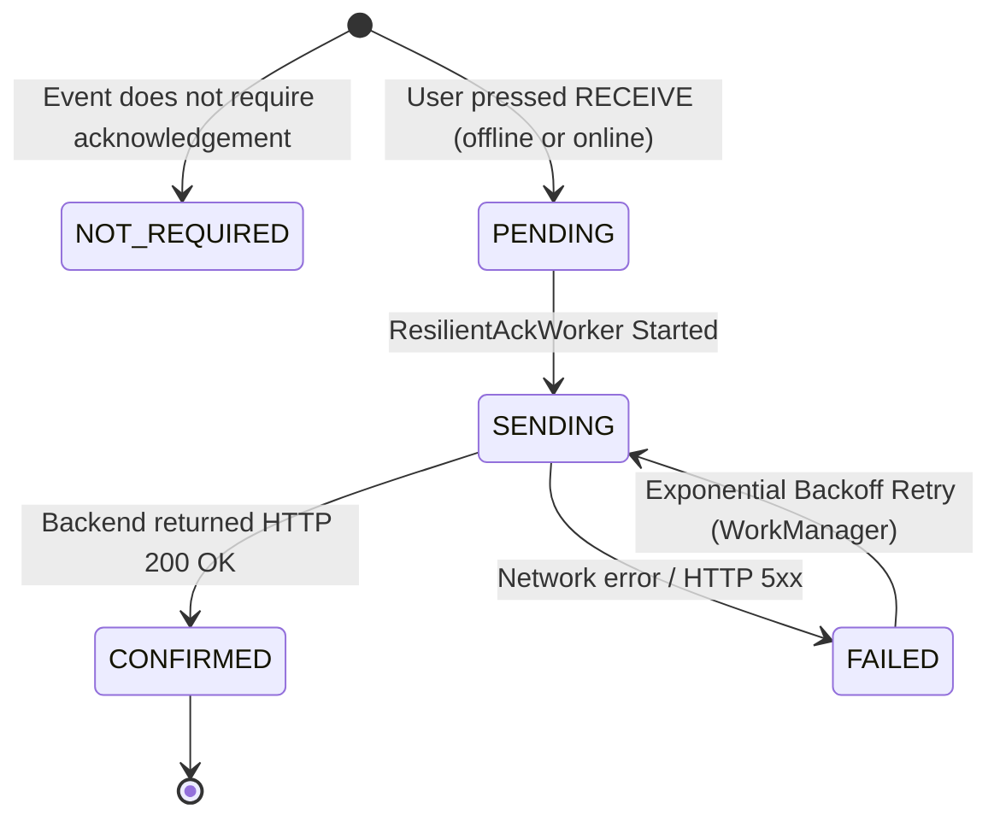

# EVENT_STATE_MACHINE: Decoupled Lifecycle & Transport States

**Date:** 2026-08-31  

---

## 🔄 1. Event Lifecycle State Machine (Local Execution)

The **Event Lifecycle State** tracks local execution on the device (not network delivery):



### Valid Event Lifecycle States:
* `SCHEDULED` — future `scheduledAt`; AlarmManager registered.
* `TRIGGERED` — receiver woke; about to ring.
* `RINGING` — `AlarmEngine` claimed session; audio/FGS active.
* `PRESENTED` — UI displayed (legacy; may overlap RINGING).
* `PRESENTATION_BLOCKED` — suppressed (ineligible, expired, permissions).
* `RECEIVED` / `DISMISSED` — user terminal actions.
* `EXPIRED` / `CANCELLED` — system/admin terminal states.

**Alarm ≠ notification.** Critical path is ring + full-screen UI, not notification-shade-only.

---

## 📡 2. Acknowledgement Transport State Machine (Network Delivery)

The **ACK Transport State** tracks the delivery of the user's receipt confirmation to the backend:



### Valid ACK Transport States:
* `NOT_REQUIRED`: Informational broadcast not requiring receipt.
* `PENDING`: Enqueued in Room `ack_queue`, waiting for `WorkManager` execution.
* `SENDING`: Currently in-flight over HTTP.
* `CONFIRMED`: Backend confirmed receipt and updated database.
* `FAILED`: Network failed; waiting for backoff timer (`attemptCount * 15s`).

---

## 🎯 Key Design Rule: Three Orthogonal Dimensions

Do not conflate:

| Dimension | Examples | Stored as |
|-----------|----------|-----------|
| **Delivery (sync)** | Event reached Room | `syncedAt`, server sync |
| **Execution** | SCHEDULED → RINGING | `EventStatus` |
| **ACK transport** | PENDING → CONFIRMED | `AckStatus` + `ack_queue` |

Normal offline ACK:

```text
EventStatus = RECEIVED
AckStatus   = PENDING
```

Backend must not treat HTTP sync alone as “alarm rang” — only explicit ACK/receive endpoints after user action.
