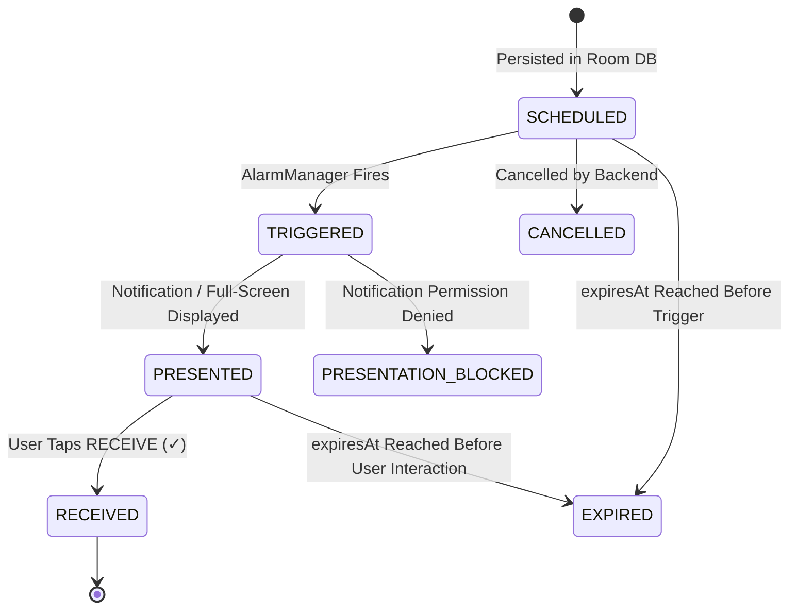
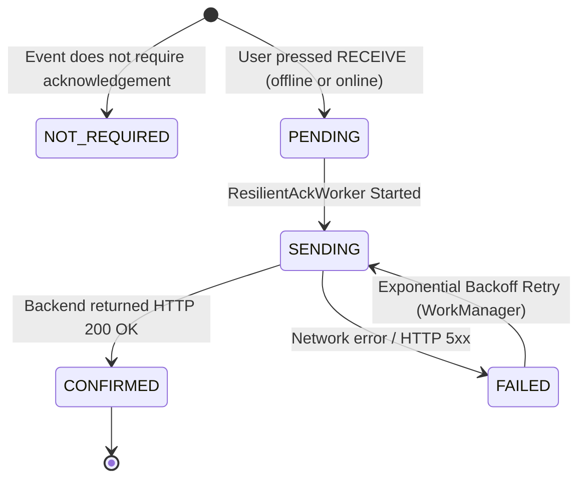

# EVENT_STATE_MACHINE: Decoupled Lifecycle & Transport States

**Date:** 2026-08-31  

---

## 🔄 1. Event Lifecycle State Machine (Local Display)

The **Event Lifecycle State** tracks what is happening locally on the device with the event presentation and user interaction:



### Valid Event Lifecycle States:
* `SCHEDULED`: Event has a future `scheduledAt` and exact alarm registered in `AlarmManager`.
* `TRIGGERED`: Alarm time has arrived; `EventAlarmReceiver` woke up the device.
* `PRESENTED`: UI has been shown to the user (either `MandatoryReceiveActivity` or Heads-Up notification).
* `PRESENTATION_BLOCKED`: Alarm triggered, but system notification permissions are disabled.
* `RECEIVED`: User pressed the **RECEIVE (✓)** button.
* `EXPIRED`: Event reached `expiresAt` before user interaction.
* `CANCELLED`: Event revoked by organization administrator.

---

## 📡 2. Acknowledgement Transport State Machine (Network Delivery)

The **ACK Transport State** tracks the delivery of the user's receipt confirmation to the backend:



### Valid ACK Transport States:
* `NOT_REQUIRED`: Informational broadcast not requiring receipt.
* `PENDING`: Enqueued in Room `ack_queue`, waiting for `WorkManager` execution.
* `SENDING`: Currently in-flight over HTTP.
* `CONFIRMED`: Backend confirmed receipt and updated database.
* `FAILED`: Network failed; waiting for backoff timer (`attemptCount * 15s`).

---

## 🎯 Key Design Rule: Complete State Orthogonality

A critical reliability invariant is that an event can be:
```text
EventStatus = RECEIVED
AckStatus   = PENDING
```
This is the normal, expected state when a user receives a critical alert while completely offline (e.g. in a basement or airplane mode). The local UI completes immediately and never blocks on network availability.
